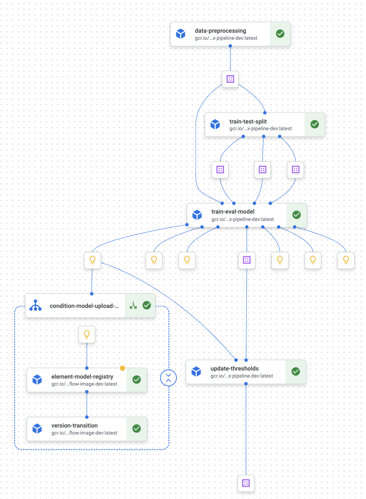
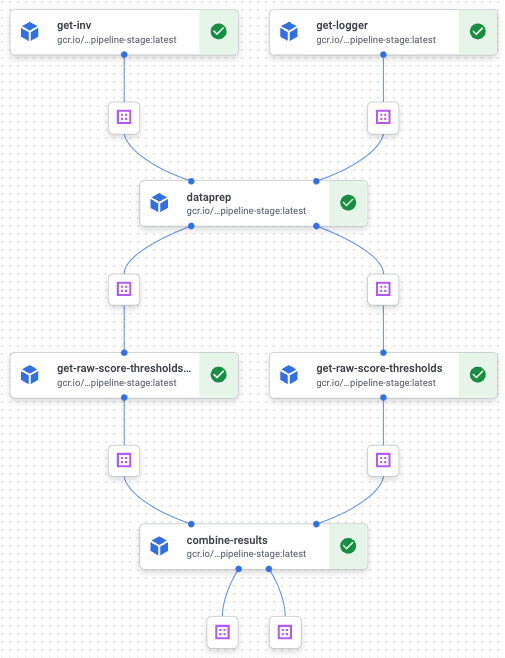

# OYI Vertex AI Training Pipeline

## Project Goal

---

Build a Repository to run Vertex pipelines for the Sam's Club OYI no-sales Model. This Training Repo follows a standardized folder and core file structure. The repo also enables users to develop code using repeatable and testable systems to quickly iterate, manage, and deploy ML pipelines and models on provisioned Google Cloud projects.

## Vertex Training Pipeline

### Training Pipeline
 <br>

NOTE: the training pipeline is 2nd approach. <br><br>

### Club Score Cutoff Pipeline
 <br><br>

### Components

1. Data preprocessing
2. Train and test data split
3. Model training and evaluation
4. Update club thresholds
5. Model registry on Element
6. Model comaprison / version transition via MLFlow

NOTE: Each container uses its own docker image that are customized and created in [/oyi-ds-vertex/custom_image_builds](https://gecgithub01.walmart.com/SamsDSE/oyi-ds-vertex/tree/main/custom_image_builds)
- training_image_creator.ipynb: training image (base); MUST have kfp>=1.8.14 due to compatibility with CICD
- [needToChange]mlflow_1at_approach.ipynb: version-transition image; uses pickle5 for loading a model due to compatibility with other package versions
- mlflow_image_creator.ipynb: MLFlow image

<br>

There are two approaches leveraged here; 1st and 2nd approaches. 
* 1st approach: two images + KFP + [CustomTrainingJobOp()](https://cloud.google.com/python/docs/reference/aiplatform/latest/google.cloud.aiplatform.CustomTrainingJob) that runs python script and connects Vertex to Element (base training image and MLFlow image that saved python script gcr.io/wmt-mlp-p-oyi-ds-or-oyi-dsns/version-transition-{ENV})
* 2nd approach: two images + KFP (base training image gcr.io/wmt-mlp-p-oyi-ds-or-oyi-dsns/oyi-vertex-pipeline-{ENV} and version-transition image gcr.io/wmt-mlp-p-oyi-ds-or-oyi-dsns/mlflow-image-{ENV})

<br>
[Google Container Registry](https://console.cloud.google.com/gcr/images/wmt-mlp-p-oyi-ds-or-oyi-dsns?project=wmt-mlp-p-oyi-ds-or-oyi-dsns)
<br>

[/oyi-ds-vertex/src/pipeline](https://gecgithub01.walmart.com/SamsDSE/oyi-ds-vertex/tree/main/src/pipeline)
* pipeline.py: linked to CICD uses the 1st approach; Once Element team add VPC_NETWORK in submit() function, it needs to be changed for 2nd approach.
* cron_training.py: linked to Concord cron job for scheduling the training pipeline (uses 2nd appraoch)
 
<br><br>

### Outputs and Logging

* Outputs associated with each pipeline run are stored in a user-specified GCS bucket. 
* Model output by itself is additionally logged into the ML Flow - Model Registry on Element.<br><br>

## Getting Started

---

Once the prerequisites have been met and the user parameters are specified, there are two options to submit pipeline jobs to Vertex.

* **Option 1.** From within a Vertex AI notebook:
  * Open a shell terminal
  * Install the `requirements.txt` file in the root of this directory
  * Navigate to and run the python file `/src/pipeline/pipeline.py`
* **Option 2.** Setup the CI/CD flow as explained in the **CI/CD Links** section below. <br><br>

### Git Repo Structure

* `src/pipeline/` : Folder for the source code used for implementing the Vertex Pipeline Job. Consists of components of the pipeline, including data preprocessing, data transformation, model training, model evaluation, and model serving.
* `src/utils/` : Folder for any additional utility modules and functions.
* `tests/`: Folder for tests that get called during the CI Process. Specific tests may be specifically called running the process for specific branches (i.e. Integration tests for the Stage branch). In this Training Repo, tests are run to validate user parameters as well as pipeline architecture.
* `custom_image_builds/`: Folder that contains notebooks to build custom Docker images necessary for this project. The same techniques demonstrated here can be used to build custom docker images for other GCP services such as Dataproc.
* `settings.yml`: Configurations to the pipeline input parameters. Separate sections for `dev`, `stage`, `prod` can be specified.
* `requirements.txt`: Module and package dependencies to run source code, including tests, utility functions, and pipeline. Must be installed to manually execute the pipeline from Vertex AI notebook.

## Prerequisites

---

### Project Permissions

* Ensure permissions are enabled to allow the pipeline access to the appropriate services (i.e. Cloud Storage, BigQuery, Container Registry, etc.).
* Example project definition with permissions setup: [OYI GCP Project Definition](https://gecgithub01.walmart.com/Public-Cloud/gcp_project_definitions/blob/main/organizations/walmart.com/GTP/data-platforms/element-vertex/prod/oyi-ds-org/wmt-mlp-p-oyi-ds-or-oyi-dsns.yaml)

### Data Sources

* Training data is from BigQuery: `oyi_train_input_temp.oyi_train_no_test_scan_temp`


### Training Image (Utils and Helper Function)

* The data_preprocess, train_test_split, train_eval_model and update_thresholds Vertex pipeline components leverage a pre-built base image that contains all the necessary utils/helper functions from the original repo ([SamsDSE/OYI-AzureDatabricks](https://gecgithub01.walmart.com/SamsDSE/OYI-AzureDatabricks))
* To build and register the image, navigate to the section `custom_image_builds` and run the notebook `training_image_creator.ipynb`.
* gcr.io/wmt-mlp-p-oyi-ds-or-oyi-dsns/oyi-vertex-pipeline-{ENV} 

NOTE: MUST have kfp>=1.8.14 due to compatibility with CICD

<br>
[Google Container Registry](https://console.cloud.google.com/gcr/images/wmt-mlp-p-oyi-ds-or-oyi-dsns?project=wmt-mlp-p-oyi-ds-or-oyi-dsns)
<br>

### Model Registry Image

* The Registry component in this Vertex pipeline calls a base image (specified by parameter `MLFLOW_IMAGE`) that allows the pipeline component to connect to the Walmart MLFlow server. This component supplies arguments from the `settings.yml` into the container to run the model registry and/or experimental tracking.
* To build and register the image, navigate to `custom_image_builds` and run the notebook: `mlflow_image_creator.ipynb`
* Long-term, the team is considering maintaining a single shared ML Flow image source specifically to enable model registry across DS projects. The end user would essentially call that image, supply parameters, and register the model.
* gcr.io/wmt-mlp-p-oyi-ds-or-oyi-dsns/mlflow-image-{ENV})

<br>
[Google Container Registry](https://console.cloud.google.com/gcr/images/wmt-mlp-p-oyi-ds-or-oyi-dsns?project=wmt-mlp-p-oyi-ds-or-oyi-dsns)
<br>

### Version Transition Image 

* This image conatains 1) MLFlow server connection and 2) a python script that registers a model with versioning and another that compare models and transition the current stage to production in MLFlow. 
* To build and register the image, navigate to `custom_image_builds` and run the notebook: `[needToChage]mlflow_1st_approach.ipynb`
* gcr.io/wmt-mlp-p-oyi-ds-or-oyi-dsns/version-transition-{ENV}

NOTE: Suggest to use pickle5 for loading a model due to compatibility with other package versions

<br>
[Google Container Registry](https://console.cloud.google.com/gcr/images/wmt-mlp-p-oyi-ds-or-oyi-dsns?project=wmt-mlp-p-oyi-ds-or-oyi-dsns)
<br>


### User-specified Parameters

* Locate `settings.yaml` in the root folder. Modify the variables and supply the appropriate arguments, including project ID, region, etc. Ensure the environments and service accounts used have the appropriate google cloud authentication and permissions:

  * `PROJECT_ID`: The Google Cloud project that this pipeline runs in.
  * `RUN_PIPELINE`: If set as `true`, the CD Process submits and runs a Vertex Pipeline Job after the Pipeline code compiles and saves.
  * `REGION`: The Google Cloud region that this pipeline runs in.
  * `GCP_SERVICE_ACCOUNT`: The service account to run the pipeline.
  * `PIPELINE_ROOT`: Specify a Cloud Storage URI that the pipelines service account can access. The artifacts of the pipeline runs are stored within the pipeline root.
  * `MODEL_REGISTRY_NAME`: The name of the Model Artifact to be registered on the ML Flow Model Registry.
  * `MLFLOW_EXP_NAME`: The ML Flow Experiment to register the Model Artifact as well as the Experiment Tracking. Which is the case for the Sam's Club Training Pipeline.
  * `MLFLOW_IMAGE`: The image URI that will be used to connect the Vertex Pipeline components to the Walmart ML Flow Server.
  * `PIPELINE_JSON`: The name of the Pipeline included in the saved Pipeline JSON name (`<PIPELINE_NAME>_<BRANCH>_<COMMIT_ID>.json`).
  * `PIPELINE_NAME`: Name used to label the Vertex Pipeline at runtime and pipeline json.
  * `BASE_IMAGE`: Base image used for components
  * `TRAINING_TABLE_NAME`: BigQuery table of training data

#### Sample User-specified parameters:
```yaml
envs:
  dev:
    VPC_NETWORK: "projects/12856960411/global/networks/vpcnet-private-svc-access-usc1"
    # Region in which pipeline runs for provision gcp
    REGION: "us-central1"
    # Base image location and version in the container which will run each task of the pipeline
    BASE_IMAGE: "gcr.io/wmt-mlp-p-oyi-ds-or-oyi-dsns/oyi-vertex-pipeline-dev:latest" 
    # Project ID for GCP
    PROJECT_ID: "wmt-mlp-p-oyi-ds-or-oyi-dsns"
    
    # MLFlow image location and version, MLFlow name, and Model registry name as OYI No Sales model
    MLFLOW_IMAGE: "gcr.io/wmt-mlp-p-oyi-ds-or-oyi-dsns/mlflow-image-dev:latest"
    MLFLOW_EXP_NAME: "oyi_training_dev"
    MODEL_REGISTRY_NAME: "oyi_nosales_model_dev" 
    
    # # Version transition image location and version
    TRANSITION_IMAGE: "gcr.io/wmt-mlp-p-oyi-ds-or-oyi-dsns/version-transition-dev:latest"
    
    # Run the pipeline when deployment is triggered for each env; OYI No Sales model pipeline, json format, and the location to store
    RUN_PIPELINE: True
    PIPELINE_NAME: "oyi-nosales-model-pipeline-dev"
    PIPELINE_JSON: "oyi-nosales-model-pipeline-dev.json"
    PIPELINE_ROOT: "gs://oyi-ds-vertex-pipeline-bucket-nonprod"
    GCS_URI: "gs://oyi-ds-vertex-pipeline-bucket-nonprod/"
    
    LATEST_NOSALES_MODEL_PATH: "gs://oyi-ds-vertex-pipeline-bucket-nonprod/latest_nosales_model_output_dev"
    LATEST_PIPELINE_PATH: "gs://oyi-ds-vertex-pipeline-bucket-nonprod/latest_training_pipeline_dev.json"
    
    # Club Threshold model pipeline, json format, and the location to store
    CLUB_THRESH_PIPELINE_NAME: "oyi-ds-club-score-cutoff-pipeline-bucket-dev"
    CLUB_THRESH_PIPELINE_JSON: "oyi-ds-club-score-cutoff-pipeline-bucket-dev.json"
    CLUB_THRESH_PIPELINE_ROOT: "gs://oyi-ds-club-score-cutoff-pipeline-bucket-nonprod"
    
    CLUB_THRESH_PATH: "gs://oyi-ds-club-score-cutoff-pipeline-bucket-nonprod/latest_club_thresh_chain_dev"
    
    CLUB_THRESH_LATEST_PIPELINE_PATH: "gs://oyi-ds-club-score-cutoff-pipeline-bucket-nonprod/latest_pipeline_dev.json"
    
    # GCP Service account
    SERVICE_ACCOUNT: "svc-oyi-ds-or-oyi-dsns-admin@wmt-mlp-p-oyi-ds-or-oyi-dsns.iam.gserviceaccount.com"
    
    # Training table name, the lastest version of Club Threshold model with its pipeline, No Sales with its pipeline.
    TRAINING_TABLE_NAME: "oyi_prod.oyi_train_no_testscan"
    
    # Model Parameters
    MODE: "test" 
    STAGE1_FLAG : "train"
    ENSEMBLE_FLAG: "train" 
    RF_CLF_MODEL_PATH: "" 
    LOGISTIC_CLF_MODEL_PATH: "" 
    STAGE1_NN_MODEL_PATH: "" 
    GNB_MODEL_PATH: "" 
    STG1_FEATURE_SELECTOR_MODEL_PATH: ""
    NOSALES_MODEL_PATH: ""
    ...
```

#### Trees for oyi-ds-vertex
Below repo skeleton will be created:

	├── README.md               <- A high-level README for set up instructions.
	├── Dockerfile              <- A fixed looper.yml required for component image builds
	├── requirements.txt        <- Auto generated file from element's Pipeline designer, defining the pipeline dag
	├── settings.yaml           <- Auto generated file from element's Pipeline designer, defining the pipeline dag
	├── custom_image_builds     <- One folder per pipeline components for which a docker image is created
	│   ├── modelRegistryImage  <- Should contain all the python source code
	│   ├── trainingModelImage  <- Can contain any additional start up scripts to be run on node start up
	│   └── requirements.txt    <- Python environment definition, list of packages to be installed specific to this node.
	├── src
	│   ├── pipeline            <- Should contain all the python source code
	│   ├── utils               <- Can contain any additional start up scripts to be run on node start up
	│   └── requirements.txt    <- Python environment definition, list of packages to be installed specific to this node.
		​

## Project + Vertex Setup Links

---

* [General GCP Project Setup](https://confluence.walmart.com/pages/viewpage.action?spaceKey=SASTDSE&title=Project+Creation)
* [Setting Up Vertex Notebook with MLFlow](https://confluence.walmart.com/display/MLPEGVC/Setting+up+MLFlow+on+Vertex+Notebooks)

## CI/CD Links

---

* [Element-Vertex/gitflow-trial](https://gecgithub01.walmart.com/Element-Vertex/gitflow-trial/tree/feature_cr)
  * [Confluence documentation](https://confluence.walmart.com/display/MLPEGVC/ML+Pipeline+-+Documentation) for above repo
  * The CI/CD for this repo is managed externally from a separate repository [Element-Vertex/concord-test](https://gecgithub01.walmart.com/Element-Vertex/concord-test/tree/dev)


## Other Links

---
* [ML Pipeline Confluence Documentation](https://confluence.walmart.com/pages/viewpage.action?spaceKey=MLPEGVC&title=ML+Pipeline)
  * Created by Google PSO team in collaboration with Element team <br><br>

* [SamsDSE/OYI_AzureDatabricks](https://gecgithub01.walmart.com/SamsDSE/OYI-AzureDatabricks/tree/c6e01e959b145583fdf21ce3a3e6c629103a8254)
  * The model training routing was built using the code found in this repository
